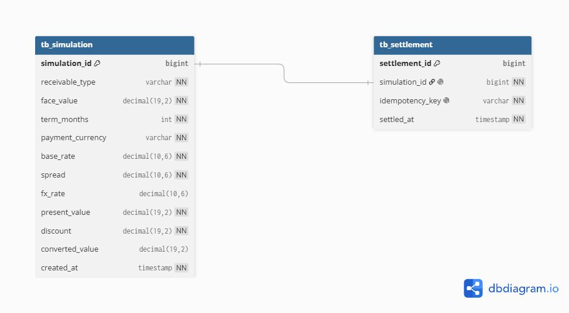

# SRM Credit Engine

Implementação do desafio técnico **SRM Credit Engine**, uma API para precificação e liquidação de recebíveis com suporte a pagamentos em BRL e USD.

A solução foi desenvolvida com foco em **corretude dos cálculos financeiros, clareza das regras de negócio e consistência durante a liquidação**.

---

## Tecnologias utilizadas

- Java 21
- Spring Boot
- Spring Data JPA
- Hibernate
- PostgreSQL
- Maven
- JUnit
- OpenAPI / Swagger

### Por que essa stack?

Optei por Java e Spring Boot por serem tecnologias maduras para construção de APIs e por fornecerem uma boa estrutura para organização das regras de negócio e integração com banco de dados.

Para os tipagem de valores financeiros foi utilizado `BigDecimal`, permitindo trabalhar com valores decimais e controlar explicitamente o arredondamento.

O PostgreSQL foi utilizado para persistir as simulações e liquidações em um banco de dados relacional.

---

## Funcionalidades

A API implementa os principais fluxos do Credit Engine:

- cadastro manual de cotações de câmbio;
- precificação de Duplicata Mercantil;
- precificação de Cheque Pré-Datado;
- cálculo de valor presente;
- cálculo do deságio;
- pagamento em BRL;
- conversão para pagamento em USD;
- liquidação de simulações;
- idempotência na liquidação;
- persistência de simulações e liquidações;
- consulta de liquidações;
- tratamento de erros;
- testes automatizados dos Golden Cases.

---

## Regras de precificação

O valor presente é calculado utilizando:

```text
Valor Presente = Valor de Face / (1 + Taxa Base + Spread) ^ Prazo
```

A taxa base utilizada é:

```text
1% a.m.
```

Cada tipo de recebível possui seu próprio spread:

| Tipo | Spread |
|---|---:|
| Duplicata Mercantil | 1,5% a.m. |
| Cheque Pré-Datado | 2,5% a.m. |

O prazo é considerado em meses inteiros.

Para os cálculos financeiros são utilizados `BigDecimal` e arredondamento `HALF_EVEN`, evitando o uso de ponto flutuante para valores monetários.

---

## Golden Cases

Os três Golden Cases disponibilizados no desafio foram implementados como testes automatizados.

| Caso | Tipo | Valor de Face | Prazo | Pagamento | FX | Resultado esperado |
|---|---|---:|---:|---|---:|---:|
| C1 | Duplicata Mercantil | R$ 100.000,00 | 3 meses | BRL | — | R$ 92.859,94 |
| C2 | Cheque Pré-Datado | R$ 25.000,00 | 2 meses | BRL | — | R$ 23.337,77 |
| C3 | Duplicata Mercantil | R$ 100.000,00 | 3 meses | USD | 5,4321 | US$ 17.094,67 |

No C3, o valor presente em BRL é calculado e arredondado antes da conversão utilizando a taxa de câmbio fornecida.

Para executar os testes:

```bash 
  mvn test
```

Além dos Golden Cases, existem testes para outros comportamentos das regras de negócio, como a tentativa de realizar uma simulação em USD sem uma cotação disponível.

---

## Currency Engine

As cotações de câmbio são cadastradas manualmente através da API.

Cada cotação possui:

- moeda;
- taxa;
- data/hora de vigência (`effectiveAt`).

Exemplo:

```json
{
  "currency": "USD",
  "rate": 5.4321,
  "effectiveAt": "2026-09-15T14:00:00"
}
```

Essa abordagem mantém o comportamento do câmbio controlado e reproduzível durante o desafio, sem depender de um serviço externo.

Mais detalhes sobre essa escolha estão disponíveis em [DECISIONS.md](DECISIONS.md).

---

## Strategy

As regras de precificação foram separadas utilizando o padrão Strategy.

```text
PricingStrategy
       |
       +-- DuplicataPricingStrategy
       |
       +-- ChequePricingStrategy
```

Cada tipo de recebível possui sua própria regra de precificação.

O `PricingCalculator` utiliza a Strategy correspondente ao tipo recebido, evitando concentrar diferentes regras de cálculo em uma única classe.

Essa abordagem também facilita a inclusão de novos tipos de recebíveis no futuro.

---

## Arquitetura

O projeto foi organizado em camadas com responsabilidades separadas:

```text
API
 |
 v
Application
 |
 v
Domain
 |
 v
Infrastructure
 |
 v
PostgreSQL
```

### API

Responsável pela comunicação HTTP da aplicação.

Contém:

- Controllers;
- DTOs de Request e Response;
- tratamento dos erros HTTP.

### Application

Responsável por orquestrar os casos de uso da aplicação e conectar as entradas da API às regras de negócio.

### Domain

Contém as principais regras de negócio do Credit Engine:

- modelos de domínio;
- cálculo de precificação;
- Strategies;
- regras relacionadas ao câmbio.

### Infrastructure

Responsável pelos detalhes de persistência utilizando JPA, Hibernate e PostgreSQL.

---

## Liquidação

Uma simulação pode posteriormente ser liquidada através do endpoint de settlement.

A liquidação é tratada como uma operação transacional para evitar que uma operação fique parcialmente persistida em caso de falha.

### Idempotência

Cada solicitação de liquidação possui uma `idempotencyKey`.

Exemplo:

```json
{
  "simulationId": 1,
  "idempotencyKey": "550e8400-e29b-41d4-a716-446655440000"
}
```

Caso a mesma operação seja repetida utilizando a mesma chave, uma nova liquidação não é criada.

Também existe uma proteção para impedir uma nova liquidação da mesma simulação utilizando outra chave.

---

## Auditabilidade

Os dados utilizados na simulação são persistidos, incluindo os valores utilizados no cálculo e, quando aplicável, a taxa de câmbio utilizada.

A liquidação possui referência à simulação que originou a operação e registra o momento em que foi realizada.

Não são disponibilizadas operações para alteração de uma liquidação já registrada.

---

## Banco de dados

A aplicação utiliza PostgreSQL para persistir simulações e liquidações.

A principal relação é:

```text
tb_simulation
      |
      | 1 : 0..1
      |
tb_settlement
```

Uma simulação pode ainda não possuir uma liquidação, porém uma mesma simulação não deve possuir múltiplas liquidações.

A chave de idempotência também possui restrição de unicidade.

### Diagrama ER



---

## Endpoints

### Cadastrar cotação

```http
POST /exchange-rates
```

Exemplo:

```json
{
  "currency": "USD",
  "rate": 5.4321,
  "effectiveAt": "2026-09-15T14:00:00"
}
```

### Realizar simulação

```http
POST /simulations
```

Exemplo BRL:

```json
{
  "receivableType": "DUPLICATA_MERCANTIL",
  "faceValue": 100000.00,
  "termMonths": 3,
  "currency": "BRL"
}
```

Exemplo USD:

```json
{
  "receivableType": "DUPLICATA_MERCANTIL",
  "faceValue": 100000.00,
  "termMonths": 3,
  "currency": "USD"
}
```

### Realizar liquidação

```http
POST /settlements
```

Exemplo:

```json
{
  "simulationId": 1,
  "idempotencyKey": "550e8400-e29b-41d4-a716-446655440000"
}
```

### Consultar liquidações

```http
GET /settlements
```

---

## Swagger

Com a aplicação em execução, a documentação da API pode ser acessada em:

```text
http://localhost:8080/swagger-ui/index.html
```

---

# Como executar

## Pré-requisitos

Antes de iniciar, é necessário ter instalado:

- Java 21;
- Maven;
- PostgreSQL;
- Git.

## 1. Clonar o projeto

```bash
git clone <git@github.com:IDantas7/Credit-Engine.git>
cd <Credit-Engine>
```

## 2. Configurar o PostgreSQL

Crie o banco utilizado pela aplicação e configure a conexão conforme as propriedades definidas no projeto.

  ```text
    DB_URL=jdbc:postgresql://localhost:5432/credit_engine
    DB_USERNAME=postgres
    DB_PASSWORD=sua_senha
```

## 3. Executar os testes

```bash
  mvn test
```

Os testes incluem os três Golden Cases fornecidos no desafio.

## 4. Executar a aplicação

```bash
  mvn spring-boot:run
```

A API ficará disponível em:

```text
http://localhost:8080
```

A documentação Swagger ficará disponível em:

```text
http://localhost:8080/swagger-ui/index.html
```

---

## Documentação

Os documentos complementares do desafio estão disponíveis na raiz do repositório:

- [SPEC.md](SPEC.md) — premissas e especificação utilizada antes da implementação;
- [REVIEW.md](REVIEW.md) — code review do código fornecido no Anexo A;
- [DECISIONS.md](DECISIONS.md) — decisões de escopo e simplificações;
- [AI_USAGE.md](AI_USAGE.md) — utilização de IA durante o desenvolvimento.

O diagrama do banco está disponível em:

- [Diagrama ER](docs/er-diagram.png)

---

## Decisões de escopo

Durante o desenvolvimento algumas escolhas foram feitas para manter o foco em corretude e clareza:

- cotação de câmbio cadastrada manualmente;
- autenticação e gerenciamento de usuários fora do escopo;
- priorização das regras de negócio e testes em relação a funcionalidades adicionais.

As decisões e suas justificativas estão detalhadas em [DECISIONS.md](DECISIONS.md).